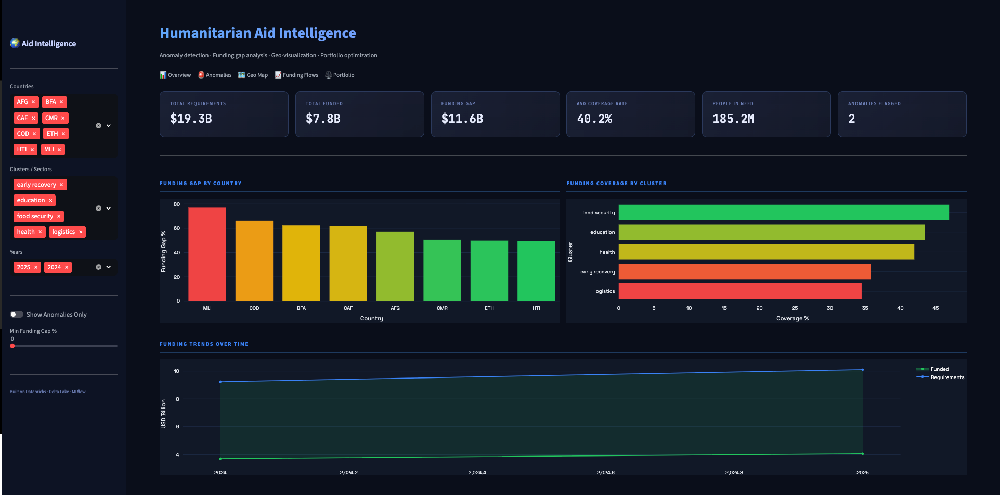
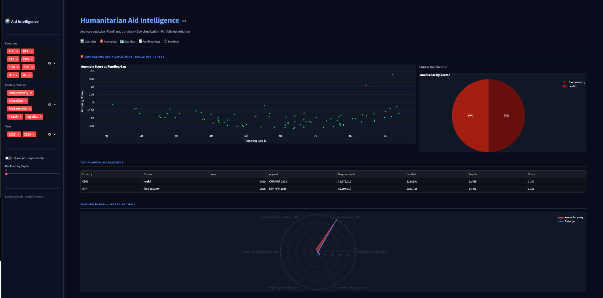
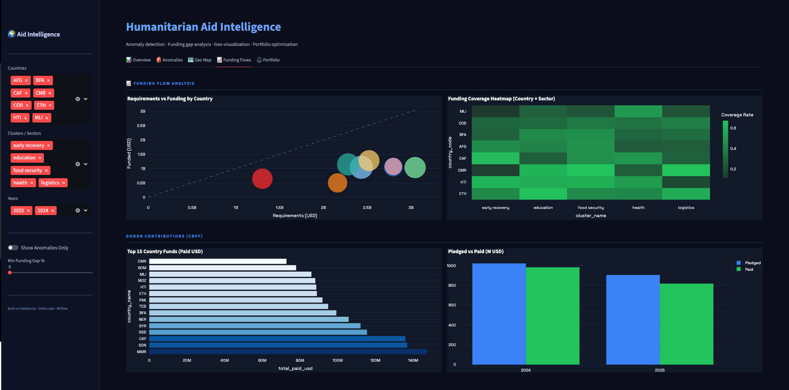
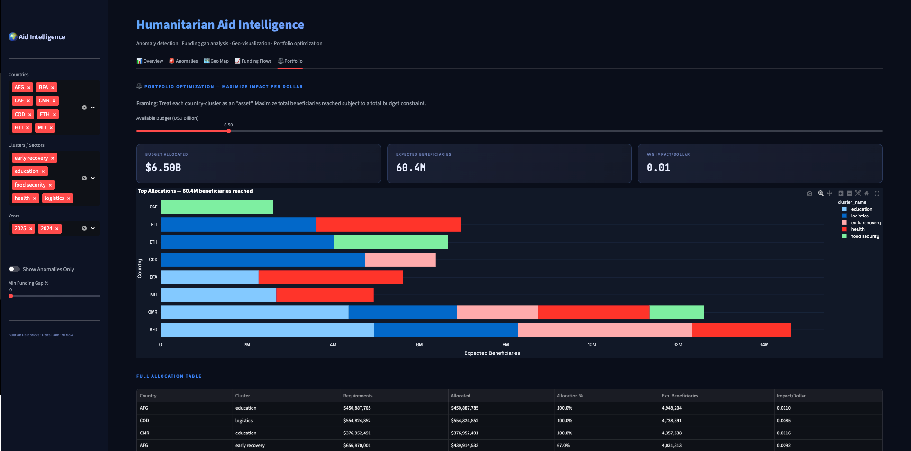

# Humanitarian Aid Intelligence

A decision support platform for humanitarian aid. It detects anomalous allocations, quantifies funding gaps, and recommends how to spend a fixed budget for maximum reach.

Built on a Databricks and PySpark pipeline with an interactive Streamlit dashboard. The app runs locally against synthetic data when Databricks is not connected, so the demo is always reproducible.

## Country Code Reference

The dashboard uses ISO3 country codes throughout. Use this table when reading any of the screenshots below.

| Code | Country | Code | Country |
|------|---------|------|---------|
| AFG | Afghanistan | MLI | Mali |
| BDI | Burundi | MMR | Myanmar |
| BFA | Burkina Faso | MOZ | Mozambique |
| CAF | Central African Republic | NER | Niger |
| CMR | Cameroon | NGA | Nigeria |
| COD | Democratic Republic of the Congo | PAK | Pakistan |
| ETH | Ethiopia | SDN | Sudan |
| HTI | Haiti | SOM | Somalia |
| SSD | South Sudan | SYR | Syria |
| TCD | Chad | YEM | Yemen |
|     |         | ZWE | Zimbabwe |

## Dashboard Tour

### 1. Overview

Top-line KPIs across the active filters: total requirements, total funded, the resulting gap, average coverage, people in need, and the count of allocations flagged as anomalous. The country bar chart ranks funding gaps so that the worst-served crises rise to the top.



### 2. Anomaly Detection

An Isolation Forest scores every country, sector, and year combination. The scatter plot maps anomaly score against funding gap so that outliers separate visually from the bulk of allocations. The table lists the worst flagged rows, and the radar compares the single worst case against the global average across all engineered features.



### 3. Funding Flows and Donors

The bubble chart on the left compares requirements to funded amounts per country, with bubble size carrying the third dimension (people in need). The heatmap exposes which sectors are chronically underfunded inside each country. The donor charts on the bottom rank pooled fund contributors and contrast pledged against paid amounts.



### 4. Portfolio Optimization

A linear program (`scipy.linprog`) treats every country and sector pair as an asset. Move the budget slider, and the optimizer reallocates spend to maximize expected beneficiaries reached. The stacked bar chart shows where the budget should land, and the table reports the resulting allocation rate, expected beneficiaries, and impact per dollar for every line.



## Pipeline Architecture

```
data/
  hpc_hno_2025.csv                              HXL format, needs and beneficiaries
  fts_requirements_funding_*.csv                HXL format, funding requirements
  cod_population_admin0.csv                     Population reference
  Projectleveldata/
    ProjectSummaryWithLocationAndCluster*.csv   CBPF project geo and cluster
    Contribution_by_Pooled_Fund_Code.csv        Donor contributions
  public_emdat_incl_hist_*.xlsx                 Disaster context

Databricks notebooks (run in order):
  01_ingestion.py    Load CSVs and Excel to humanitarian.raw_* Delta tables
  02_pipeline.py     Join and feature engineering to humanitarian.features
  03_anomaly.py      IsolationForest, KMeans, MLflow to humanitarian.anomalies

Streamlit app:
  app.py             Reads Delta tables, falls back to synthetic data
```

## Datasets

| Dataset | Role |
|---------|------|
| `hpc_hno_2025` | People in need and people targeted, the core beneficiary signal |
| `fts_requirements` | Requirements vs funded per country, cluster, year |
| `ProjectSummaryWithLocationAndCluster` | Project level geography, organization, cluster, budget |
| `Contribution_by_Pooled_Fund_Code` | Donor flows: pledged vs paid |
| `cod_population_admin0` | Per capita normalization |
| `public_emdat` | Disaster severity context for anomaly scoring |

Excluded: `fts_incoming/outgoing/internal` (overlaps with requirements), `HRP` (redundant), `PipelineProject*` (subset of ProjectSummary).

## Engineered Features

**Funding efficiency**
- `funding_coverage_rate`: fraction of requirements actually funded
- `funding_gap_usd` and `funding_gap_pct`: absolute and percentage shortfall
- `funding_per_capita` and `requirement_per_capita`: per person normalization

**Beneficiary impact**
- `beneficiary_to_funding_ratio`: people targeted per dollar funded
- `need_to_requirements_ratio`: people in need per dollar requested
- `targeting_coverage_rate`: percentage of people in need being targeted
- `cost_per_beneficiary`: USD per person targeted

**Context**
- `disaster_severity_score`: composite from EMDAT (deaths, affected, frequency)
- `sector_funding_efficiency_pct`: sector wide funding rate
- `project_vs_sector_avg`: how a project compares to its sector

## Models

**Isolation Forest (anomaly detection)**
- 9 engineered features, 5 percent contamination, 100 estimators
- Writes `is_anomaly` and `anomaly_score` per country, cluster, year row
- MLflow tracks contamination, anomaly count, and anomaly rate

**K Means (peer benchmarking)**
- K auto selected between 4 and 12 by silhouette score
- Assigns each project to a comparable peer group
- MLflow tracks K, inertia, and silhouette score

**Portfolio optimization (`scipy.linprog`)**
- Maximize the sum of beneficiaries weighted by allocation
- Subject to total spend not exceeding the budget slider
- Runs interactively inside the dashboard

## Running Locally

```bash
pip install -r requirements.txt
streamlit run app.py
```

No Databricks connection required. The app generates synthetic data with the same schema if the Delta tables are unreachable.

## Databricks Setup

1. Upload the data files to DBFS at `/Workspace/Users/{your_email}/crisis_quant/data/`
2. Run `01_ingestion.py` to create the `humanitarian.raw_*` tables
3. Run `02_pipeline.py` to create `humanitarian.features`, `.projects`, and `.contributions`
4. Run `03_anomaly.py` to create `humanitarian.anomalies` and log to MLflow
5. Deploy `app.py` as a Databricks App, or export and host on Streamlit Cloud
